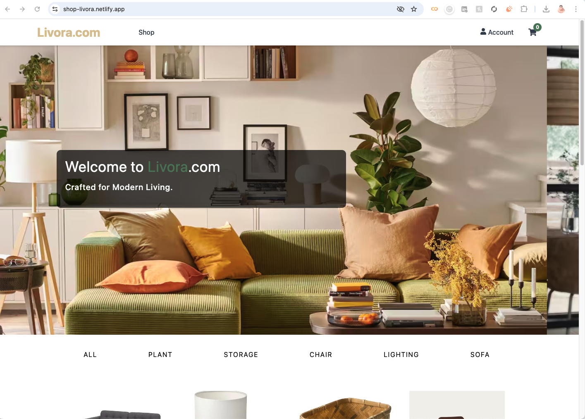
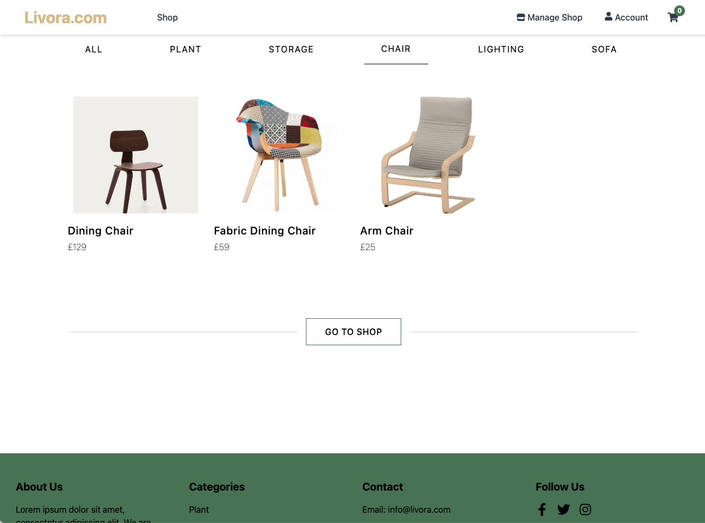
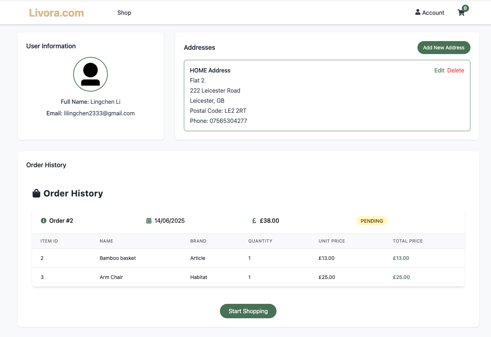

# Livora Frontend

This is the frontend of **Livora**, an e-commerce furniture platform. The frontend is built with **React** and styled using **Tailwind CSS**, providing a fast, responsive, and modern user experience. You can find the backend [here](https://github.com/lingchen2333/Livora-backend).

## Tech Stack

- React (with Vite)
- Tailwind CSS
- Redux Toolkit (state management)
- React Router (SPA routing)
- Axios (API communication)
- JWT for auth integration with backend
- Netlify (deployment)

---

## Features

- Product Listing and Detail Views
- Search and Filter Products
- User Authentication (Login/Register)
- Cart and Checkout Functionality
- Order History for Logged-In Users
- Admin Interface to Add/Remove Products
- **Search by Image (OpenAI CLIP + ChromaDB)** [Local Only]

---

## Live Demo

🔗 [https://shop-livora.netlify.app](https://shop-livora.netlify.app)

> **Note**: The backend is hosted on [Render](https://livora-backend-latest.onrender.com) using the free tier, which means it may take **5 min to spin up** after a period of inactivity. You may notice a short delay on the first request — this is expected behavior on free-tier Render services.

> **Image Search Feature (powered by OpenAI)**: This project includes a feature to **search for products by image** using OpenAI's CLIP model and a Chroma vector store. However, **this feature is currently disabled in the live demo** due to the high cost of deploying and hosting a persistent vector database. You can run it locally by following the instructions in the backend README.

---

## Screenshots

### Homepage

  
  
  

---

### Product Listing


---

### Shopping Cart

## 

---

### Checkout


---

### User Login and Registration


---

### User Information and Order



---

### Search by Image


---

### Store Management by Admin


---

## 💻 Folder Structure

```
src/
 ├── assets/
 ├── components/
 ├── features/
 │    ├── auth/
 │    ├── products/
 │    └── cart/
 ├── pages/
 ├── services/       # API calls using Axios
 ├── store/          # Redux Toolkit setup
 └── App.jsx
```

---

## 📄 License

This project is licensed under the [MIT License](./LICENSE).
